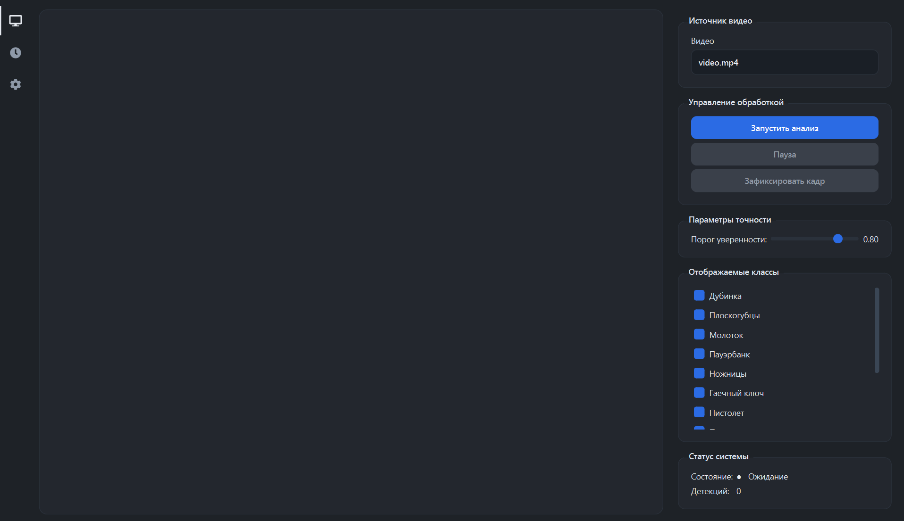
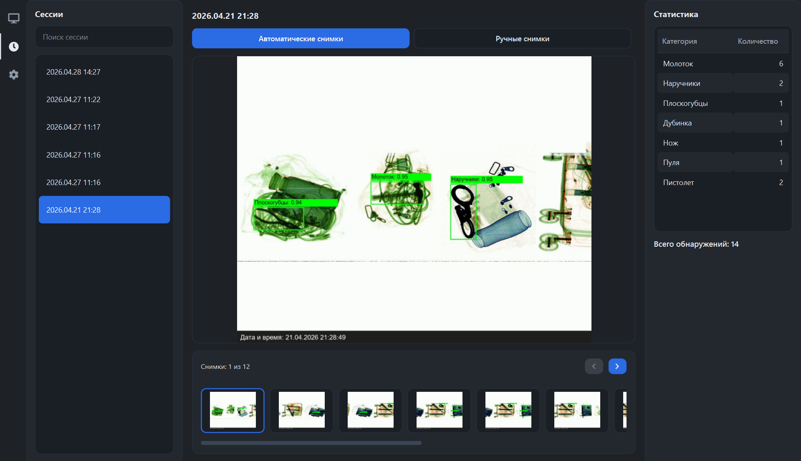
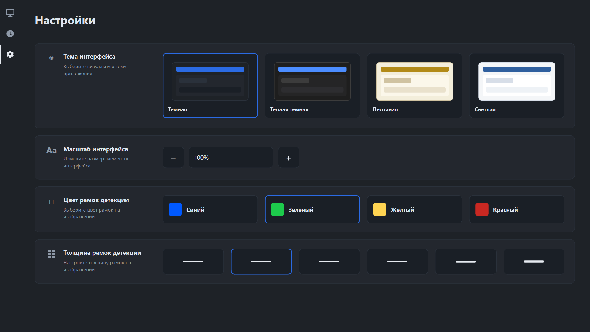

# XRayDetector

Приложение для автоматического обнаружения потенциально опасных предметов на рентгеновских изображениях багажа.

Приложение реализовано как программный прототип, поэтому вместо действительного подключения к интроскопу используются заранее подготовленные видео.

Программа позволяет выбрать видеоисточник, запустить анализ видеопотока, отобразить результаты детекции на кадре, сохранить важные снимки, просмотреть историю анализа и настроить внешний вид интерфейса.

---

## 1. Назначение приложения

Приложение выполняет следующие функции:

- загрузка рентгеновского видеопотока из файла;
- автоматическое обнаружение потенциально опасных объектов;
- отображение найденных объектов с помощью ограничивающих рамок;
- отображение класса объекта и уверенности модели;
- ручное сохранение текущего кадра;
- автоматическое сохранение кадров с обнаруженными объектами;
- просмотр истории проведённых сеансов анализа;
- просмотр сохранённых снимков;
- настройка интерфейса и параметров отображения результатов.

---

## 2. Основные возможности

В приложении доступны три страницы: **Анализ**, **История** и **Настройки**.

### Анализ



На странице анализа можно:

- выбрать видеофайл для обработки;
- запустить, приостановить, продолжить и остановить анализ;
- видеть результаты детекции на кадре;
- изменить порог уверенности модели;
- выбрать отображаемые классы объектов;
- вручную сохранить текущий кадр.

### История



На странице истории можно:

- просматривать сохранённые сеансы анализа;
- открывать автоматические и ручные снимки;
- просматривать статистику обнаруженных объектов;
- искать нужные сеансы;
- удалять выбранные сеансы или отдельные снимки.

### Настройки



На странице настроек можно:

- выбрать тему интерфейса;
- изменить масштаб интерфейса;
- изменить цвет рамок детекции;
- изменить толщину рамок детекции.

Выбранные настройки сохраняются и восстанавливаются при следующем запуске приложения.

---

## 3. Структура папки приложения

В собранной версии папка приложения имеет следующую структуру:

```text
XRayDetector/
├── XRayDetector.exe
├── _internal/
├── configs/
├── models/
├── data/
│   └── videos/
├── logs/
└── assets/
```

Назначение основных папок:

- `XRayDetector.exe` — файл запуска приложения;
- `configs/` — файлы конфигурации приложения;
- `models/` — модели обнаружения объектов;
- `data/videos/` — папка с видеофайлами для анализа;
- `logs/` — служебные журналы работы приложения;
- `assets/` — изображения, иконки и другие ресурсы интерфейса;
- `_internal/` — служебные файлы, необходимые для работы собранного приложения.

---

## 4. Запуск из исходного кода

Для запуска из исходного кода требуется установленный **Python**.

Рекомендуется использовать **Python 3.10** или выше.

### 4.1. Создание виртуального окружения

В корневой папке проекта выполните команду:

```bash
python -m venv .venv
```

Активируйте окружение:

```bash
.venv\Scripts\activate
```

### 4.2. Установка зависимостей

Установите зависимости командой:

```bash
pip install -r requirements.txt
```

### 4.3. Запуск приложения

После установки зависимостей запустите приложение командой:

```bash
python main.py
```

---

## 5. Сборка приложения

Для сборки приложения в исполняемый файл используется **PyInstaller**.

Установите PyInstaller:

```bash
pip install pyinstaller
```

Пример команды сборки для Windows:

```bash
pyinstaller ^
  --name XRayDetector ^
  --windowed ^
  --add-data "configs;configs" ^
  --add-data "models;models" ^
  --add-data "data;data" ^
  --add-data "logs;logs" ^
  --add-data "assets;assets" ^
  main.py
```

После завершения сборки готовое приложение будет находиться в папке:

```text
dist/XRayDetector/
```

Для запуска собранной версии откройте файл:

```text
dist/XRayDetector/XRayDetector.exe
```

---

## 6. Скачать собранное приложение

Готовую собранную версию приложения можно скачать по ссылке:

[Скачать XRayDetector с Google Диска](https://drive.google.com/file/d/17KWrq3jeXJZJ1ZFCVMilCSoVxIl8hYR4/view?usp=sharing)


## 7. Набор данных

Модели обучались [на этом наборе данных](https://www.kaggle.com/datasets/annnakiryan/x-ray-dataset-imgsize-1000x1000)
